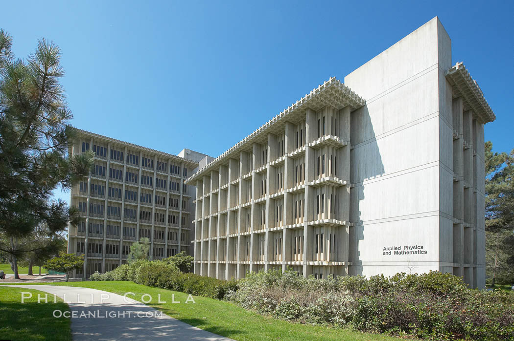

# Brian's Lab 1
## Images
This is my favorite building on campus:



This is a picture of Professor Powell:


## Text Styling
Here's some *italicized* text, some **bold** text, some ~~struckthrough~~ text. 
This is a subscript: a<sub>b</sub>.
And, this is a superscript: a<sup>b</sup>.
## Quoting
My favorite recent project has been [an interpreter for the esolang Brainf**k.](https://github.com/mrtonbrian/BrainSomethingInterpreter) Surprisingly, GitHub supports it as a markdown highlighting syntax. Here is what "Hello World" looks like:
```bf
++++++++++[>+++++++>++++++++++>+++>+<<<<-]>++.>+.+++++++..+++.>++.<<+++++++++++++++.>.+++.------.--------.>+.>.
```
A pretty good quote for programmers is:
> "Measuring programming progress by lines of code is like measuring aircraft building progress by weight." - (Bill Gates)
## Linking
### External Links
This is an external link to [my favorite song](https://www.youtube.com/watch?v=dQw4w9WgXcQ).
### Internal Links
This is an internal link to the [section on text styling](#text-styling)
### Relative Links
This links to [the file for my favorite building on campus](images/apm.jpg).
## Lists
### Unordered List
This is an unordered list of my friend's names (they're all equally important)
- Jaden
- Andrew
- Ailyn
- Isaac
- Hiela
### Ordered List
This is an ordered list of my favorite subjects
  1. Math
  2. Computer Science
  3. I don't know what else to put here
### Task List
My tasks for this week
- [x] Finish CSE 110 Lab
- [x] Finish Math 140B Homework
- [ ] Finish Math 100C Homework
- [ ] Finish Math 114 Homework